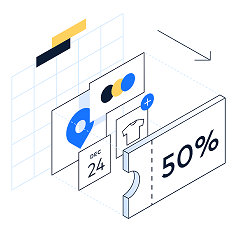

<h1> Coupon System - Spring</h1>

<!-- ABOUT THE PROJECT -->
<h2> ⭐About The Project</h2>
Coupon management system.

Allow companies to generate coupons as part of the marketing campaigns they run.

The system also has registered customers. Customers can purchase coupons.

The system documents the coupons purchased by the customer.

Access to the system is divided into 3 types of Users:
1. Admin - Managing the list of companies and the list of customers.

2. Company - Management of a list of coupons associated with the company. 

3. Customer - Purchase coupons.

<h2> 💻Technologies:</h2>

·         Java

·         Spring Framework

·         Hibernate

·         Spring Boot

·         Spring JPA

·         MySQL

<h2> 📋 Instructions: </h2>

<ol>
    <li>Run <b>"CouponProjectSpringApplication"</b> class, in order to test the Applications test. </li>
     
    <li>The test classes includes the logical function in the program, and the Coupon Daily Job Task.</li>
     
    <li>CLR - Test classes were build using command line runner.</li>
     
    <li>Logger (log4j) - we used the logger at the  service and test class, in order to display methods working status. </li>
</ol>

<h2>Authors:</h2>

<h3>Idan Kakun</h3>
    
    
<h3>Meital Mor</h3>
    
    

   

